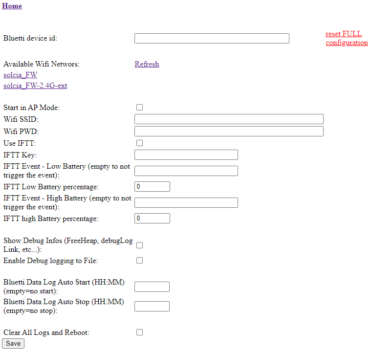

## About
This is an ESP32 based Bluetooth Web Server for BLUETTI power stations. The project is based on https://github.com/warhammerkid/bluetti_mqtt and further development from https://github.com/mariolukas/Bluetti_ESP32_Bridge (thanks to all the contributors there).

The code is tested on a some devices listed below. Other Powerstations should also work but are untested yet. The discussion on https://diysolarforum.com/threads/monitoring-bluetti-systems.37870/ was a great help for understanding the protocol. 

## Features

* easy configuration with WiFi manager
* IFTT support for low and high battery level commands
* BT Disconnect and Reconnet without device reboot
* support for BLUETTI power stations
  * AC300 (tested) 
  * AC200 (tested)
  * EB3A (testes) 
  * EP500 (untested)
  * EP500P (untested)
* supported BLUETTI functions
  * commands
    * ac output on/off
      * Directly from the page
    * dc output on/off
  * states
    * ac input power
    * dc input power
    * ac output power
    * dc output power
    * dsp firmware version
    * arm firmware version
    * serial number
    * device type
    * power generation
    * total battery percent

## Getting Started

### Compiling and Flashing to ESP32

#### Arduino IDE

You will need to install a board support package for your ESP32. Additionally the follwing libraries are needed: 

* https://github.com/ayushsharma82/AsyncElegantOTA
* https://github.com/me-no-dev/ESPAsyncWebServer
* https://github.com/me-no-dev/AsyncTCP/archive

Change the partition scheme with Tools -> Partition Scheme to 
 	
* Minimal SPIFFS (1.9 MB App with OTA/ 190KB SPIFFS)

Optional: Do changes in config.h file. The device can be set by changing 'BLUETTI_TYPE'. 

Finally upload the Sketch to your ESP32.
TODO: instruction to upload the data folder with Arduino IDE

#### PlatformIO

Fastest way is to use VSCode and PlatformIO extension.

Build and Upload commands in the UI will let you load the firmware to the device.

The HTML related files are in the /data folder and can be uploaded with the extension (see a more detailed [guide](https://randomnerdtutorials.com/esp32-vs-code-platformio-spiffs/) )

### Usage

Just connect the ESP32 to a power supply or the power station itself. Connect your mobile phone or computer
to the Wifi manager of the ESP32 firmware, it should show up as "BLUETTI-ESP32".

After the connection to the hotspot is established a wifi manager popup will appear. Otherwise
open http://192.168.4.1 or http://bluetti-esp32.local/ in your local webbrowser. 

Select "Change Configuration" (will take some time to load as a wifi scan is running)

1. enter the Bluetooth ID of your 
Bluetti Device. You can use a mobile phone and/or the Bluetti APP for finding the correct Bluetooth ID of your device.
2. Select the wifi network and configure the password, or Start in AP Mode wo keep creating the BLUETTI-ESP32 wifi network
3. Select use IFTT and set the various WebHooks parameters if needed (TODO: more details on how to set up WebHooks in a supported manner)
4. Select if devug infos show be shown in the main page
5. Enable debug log to file inside SPIFFS (can be downloaded from the main page)
6. Set when to start and stop logging to file all the Bluetti Data  (can be downloaded from the main page)
7. Clear all log files on reboot (if clearing them from the main page fails)

Save the settings

**WARNING**

Most of the settings do no require a device reboot, but some (wifi, clear all logs) do.
Reset Full Configuration will clear all configs and reboot the device like it was just flashed
Bluetti data log can fill up the remaining SPIFFS space pretty quick (around 1 log every 5 seconds), and a full SPIFFS makes the device unstable, **BE CAREFULL**

### IFTT
TODO: detailed config

Low Battery percentage will be triggered every 5 minutes if no ac_input_power is detected and the percentage is <= the configured percentage.
If AC output is ON, will be forced OFF (TODO: check in config)

High Battery percentage will be triggered every 2 minutes if ac_input_power IS detected and the percentage is >= the configured percentage.

----
Going back to home after a succesfull connection

The ac Output slider will turn on/off the ac output (n.b. might seem to rever back in the ui, wait 5 / 10 secs for a BT update from the device).

Updates are sent using WebSockets, so no refresh is needed (you can check and force a refresh if last WebSocket message was received more than 5 / 10 secs from the current time).

### OTA UPDATE
Elagant ota update can be accessed from the OTA UPDATE link in the main page.
Firmware (build/firwmare.bin) and file System (build/spiffs.bin) can be uploaded. (N.B. a reboot will be performed after each upload)
    

### TODOS:
- more details for ifft config
- more configs for hardcoded behaviours (es. ac off on low battery)
- more details on build flags in config
- auto stop bluetti data log when SPIFFS over 95% ... and maybe a notification
- code refactor

## Disclaimer

The code within this repository comes with no guarantee, use it on your own risk.

Don't touch these firmwares if you don't know how to put the device in the programming mode if something goes wrong.
As per the GPL v3 license, I assume no liability for any damage to you or any other person or equipment.
